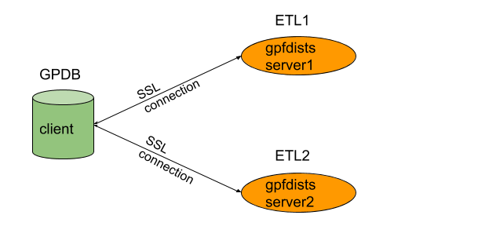

The gpfdists protocol is a secure version of the gpfdist protocol that securely identifies the file server and the Greenplum Database and encrypts the communications between them.
Please make sure that you have read [Encrypting gpfdist Connections](http://docs.greenplum.org/6-4/security-guide/topics/Encryption.html#gpfdist_connections) in Greenplum database documentation before using this guide.

## Scenario overview:

## Prepare private keys and certificates

Prepare SSL certificate folder for server1 and server2

	for server1: ${path_of_server1_cert}

	for server2: ${path_of_server2_cert}

#### Generate certificates by yourself, server1 and server2 use the same root CA

   - Generate root certificate and intermediate certificate, in ${path_of_server1_cert}, run

         gen_root_cert.bash

    - Generate server and client certificates for server1, run
    
          gen_sc_certs.bash server1 client1

    - Copy root and intermediate CA to  ${path_of_server2_cert} and generate server and client certificates for server2, run
    
     	  gen_sc_certs.bash server2 client2

#### Generate certificates by yourself, server1 and server2 use different root CA

   - Generate root, intermediate, server and client certificate for server1 in  ${path_of_server1_cert}, run
    
         gen_all_certs.bash rootca1 interca1 server1 client1

   - Generate root, intermediate, server and client certificate for server2, in  ${path_of_server2_cert}, run
    
         gen_all_certs.bash rootca2 interca2 server2 client2

   - Merge server1 and server2 root CA

         cat ${path_of_server1_cert}/root.crt >> ${path_of_server2_cert}/root.crt   
     	     
         cp ${path_of_server2_cert}/root.crt ${path_of_server1_cert}/root.crt

#### Obtain certificates from a well known provider

Instead of generating yourself, you also can send a Certificate Signing Request(CSR) to the provider and obtain the corresponding certificate signed by them, along with the whole certificate chain   
You need to merge server1 and server2 root CA too, if they are different.

## Verify server side certificates
#### 1. Start gpfdist on server1 and server2  
	gpfdist --ssl ${path_of_server1_cert} -d ${path_of_server1_data} -p ${server1_port}

	gpfdist --ssl ${path_of_server2_cert} -d ${path_of_server2_data} -p ${server2_port}
#### 2. Run openssl s_client to verify server side certificate
take server1 for example.  

    openssl s_client -cert ${path_of_server1_cert}/client.crt -key ${path_of_server1_cert}/client.key -CAfile ${path_of_server1_cert}/root.crt -connect ${server1}:${server1_port}
#### 3. You can also run curl command to verify server side certificate
    curl -H "X-GP-PROTO: 1"  https://${server1}:${server1_port}/${data_file} -v --cert ${path_of_server1_cert}/client.crt --key ${path_of_server1_cert}/client.key --cacert ${path_of_server1_cert}/root.crt

### Load data from ETL servers
#### update certificates of all GPDB segments  
   suppose we use server1's certificates, run  

    update_gpdb_certs.bash ${path_of_server1_cert}

Then you can create external table and load data from server1 and server2 at the same time.